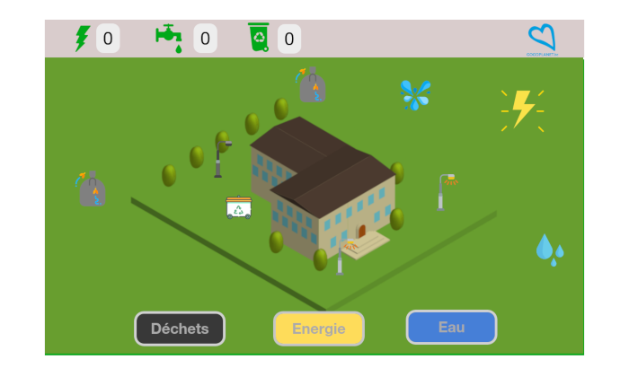
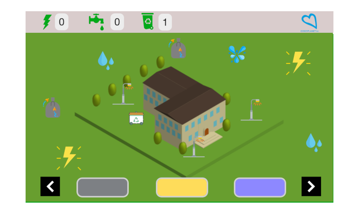
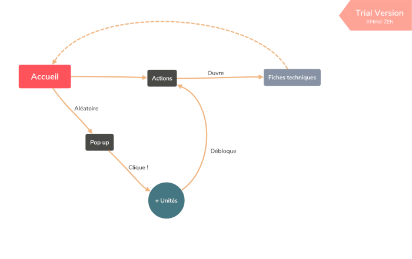

# Good School Digitool
- **Client** : [GoodPlanet Belgium](http://www.goodplanet.be/fr/index.php)
- **Contact** : Simon Reijniers - Project Manager
+32 (0)474 98 04 62
s.reijniers@goodplanet.be

- **Où ?** : [Hack in th woods](http://www.hackinthewoods.be/)
- **Quand ?** :  02/08 - 05/08/2018
- **Par ?** : 
- [Cédric Fournier](https://github.com/Cedric-Fournier) : Project Manager
- [Adrien d'Oreye](https://github.com/adridor) : Communication Manager 
- [Guillaume Kreit](https://github.com/Guillaume-Kreit) : Communication Manager
- [Jesse Fumba](https://github.com/JFumba) : Team Manager
- [Marie Cambie](https://github.com/MCambie) : Team Manager
- **Le jeu** : https://cedric-fournier.github.io/Good-School-Digitool/

## Demande client : 
GoodPlanet est  une organisation éducative durable et touche environ 500 000 enfants par an. 
Nous construisons un outil en ligne qui présente des données réelles sur l'énergie, l'eau, les déchets, la mobilité et la nourriture de leur propre vie scolaire d'une manière adaptée aux enfants. De cette façon, nous pouvons commencer une éducation durable dans des ateliers avec de vraies données, ce qui augmentera leurs connaissances et leur intérêt pour les sujets durables dont nous discutons. L'école les utilisera également par leurs propres moyens. L'outil sera utilisé dans des centaines voire des milliers d'écoles. 
Energie-ID, notre partenaire (https://www.energieid.be), collecte et stocke les données. 
Ce que nous vous proposons, c’est de concevoir plusieurs façons de convertir les différents ensembles de données bruts (litres d’eau par an, kWh d’électricité par mois,…) de manière agréable, compréhensible, simple, ludique et interactive, avec des  niveaux de gamification dans la présentation des données.
Laissez libre cours à votre esprit de programmation créatif et intelligent en trouvant des moyens visuels originaux et créatifs pour faire passer le message aux enfants!     

## Cahier des charges : 
Pour le consulter,cliquez [ici](cdc.docx)

## Notre solution : 
Good School Digitool

Nous proposons a GoodPlanet une solution pour les aider à sensibiliser les élèves a la consommation d’eau, d’énergie et à la gestion des déchets : 
GoodPlanet possèdant une base de données d'actions à accomplir pour réduire l'impact écologique des écoles, nous allons développer un jeu de gestion se basant sur celle-ci.

Aléatoirement, des éléments apparaitront sur l’interface, ces éléments correspondent à 3 catégories (eau, énergie et déchets) auxquelles ils rapportent un point.

Grâce à ces points, les élèves peuvent débloquer une action qu’il est possible de reproduire au quotidien.

Pour inciter les élèves à s’intéresser au jeu, un système de récompense a été mis en place.

Il y a 2 types de récompenses: 
1. à partir d’un certain nombre d’action, l’élève pourra personnaliser une partie de l'interface. 
2. à partir d’un nombre plus important d’action débloquées, Goodplanet enverra des goodies pour récompenser l’école.
 

## Maquette du projet :
La maquette est provisoirement (jusqu'au 17 août 2018) accessible [ici](https://share.proto.io/3KDT5J/).
Quelques captures d'écran:

## UML :

## Demo : 

## Project Board : 
[KANBAN](https://github.com/Cedric-Fournier/Becode-Hackathon-Hack-In-The-Woods-2018/projects/1)
