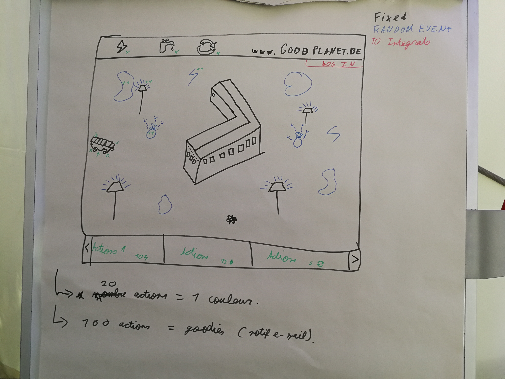

# Good School Digitool
- **Client** : [GoodPlanet Belgium](http://www.goodplanet.be/fr/index.php)
- **Contact** : Clément Magos, c.magos@goodplanet.be, +32470100665
- **Where ?** : [Hack in th woods](http://www.hackinthewoods.be/)
- **When ?** :  02/08 - 05/08/2018
- **By who ?** : 
- [Cédric Fournier](https://github.com/Cedric-Fournier) : Project Manager
- [Adrien d'Oreye](https://github.com/adridor) : Communication Manager 
- [Guillaume Kreit](https://github.com/Guillaume-Kreit) : Communication Manager
- [Jesse Fumba](https://github.com/JFumba) : Team Manager
- [Marie Cambie](https://github.com/MCambie) : Team Manager
- **The Website** : 

## Demande client : 
With  GoodPlanet  we  are  a  sustainable  educative  organisation  and  reach  about  500  000  children  per  year.  We  are  building  an  online  tool  which  shows  real  data  about  energy,  water,  waste,  mobility  and  food  of  their  own  school-life  in  a  child-friendly  manner.  This  way  we  can  start  sustainable  education  in  workshops  with  real  data  which  will  increase  their  knowledge  and  level  of  interest  in  the  sustainable  topics  we  discuss.  The  school  will  also  use  them  on  their  own.  The  tool  will  be  used  in  hundreds  or  even  thousands  of  schools.  Energie-ID  is  our  partner  (https://www.energieid.be)  and  collects  and  stores  the  data.  What  we  propose  is  for  you  to  design  several  ways  of  converting  the  different  dry  data  sets  (litres  of  water  per  year,  kwh  of  electricity  per  month,  ...)  in  a  nice,  understandable,  simple,  playful,  interactive  way  and  to  introduce  a  level  of  gamification  in  the  data  presentation.  
Let  your  creative  and  smart  programming  minds  go  wild  in  finding  original,  creative  visual  ways  of  getting  the  message  to  the  children!       

## Cahier des charges : 
[HERE](cdc.docx)

## Notre solution : 
Good School Digitool

Nous proposons a GoodPlanet une solution pour les aider à sensibiliser les élèves a la consommation d’eau, d’énergie et à la gestion des déchets : 
GoodPlanet possèdant une base de données d'actions à accomplir pour réduire l'impact écologique des écoles, nous allons développer un jeu de gestion se basant sur celle-ci.

Aléatoirement, des éléments apparaitront sur l’interface, ces éléments correspondent à 3 catégories (eau, énergie et déchets) auxquelles ils rapportent un point.

Grâce à ces points, les élèves peuvent débloquer une action qu’il est possible de reproduire au quotidien.

Pour inciter les élèves à s’intéresser au jeu, un système de récompense a été mis en place.

Il y a 2 types de récompenses: 
1. à partir d’un certain nombre d’action, l’élève pourra personnaliser une partie de l'interface. 
2. à partir d’un nombre plus important d’action débloquées, Goodplanet enverra des goodies pour récompenser l’école.
 

## Maquette du projet :

## UML :
## Project Board : 
[KANBAN](https://github.com/Cedric-Fournier/Becode-Hackathon-Hack-In-The-Woods-2018/projects/1)
